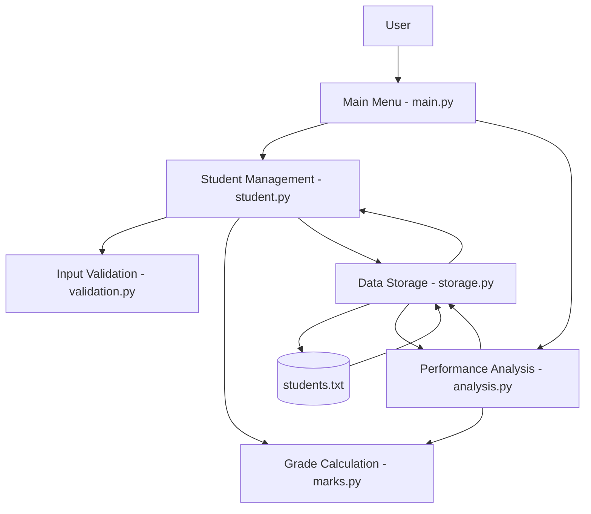
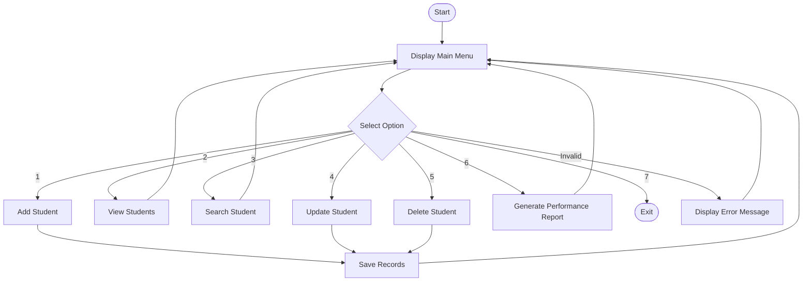

# Student Performance Management System - Diagrams

## 1. System Architecture Diagram

## 2. System Workflow Diagram

## 3. Data Storage Design

Each student record contains these fields:

| Field | Description |
|---|---|
| Name | Student's name |
| Roll Number | Unique student identifier |
| Marks | Marks obtained out of 100 |
| Grade | Grade calculated from marks |

The records are stored in `students.txt`.
Each line represents one student record.